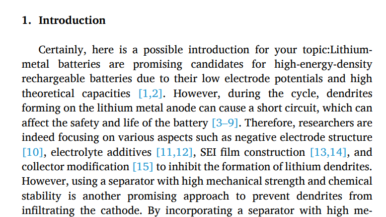
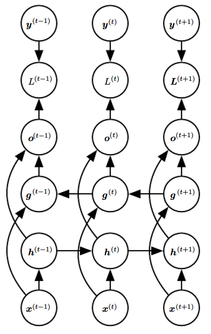
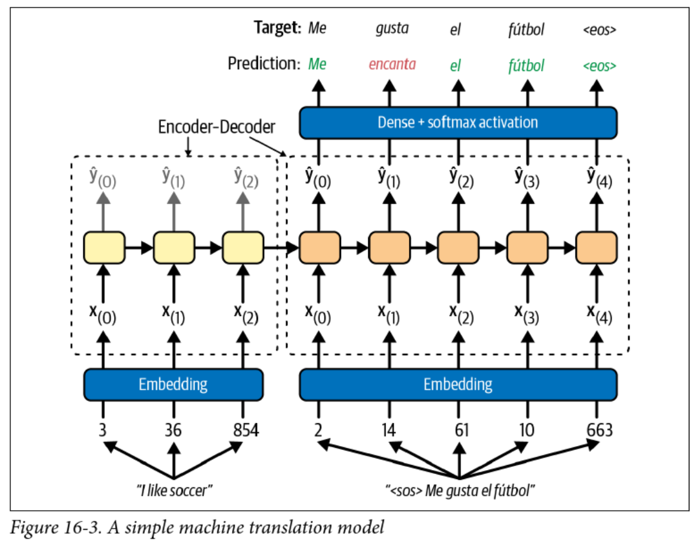
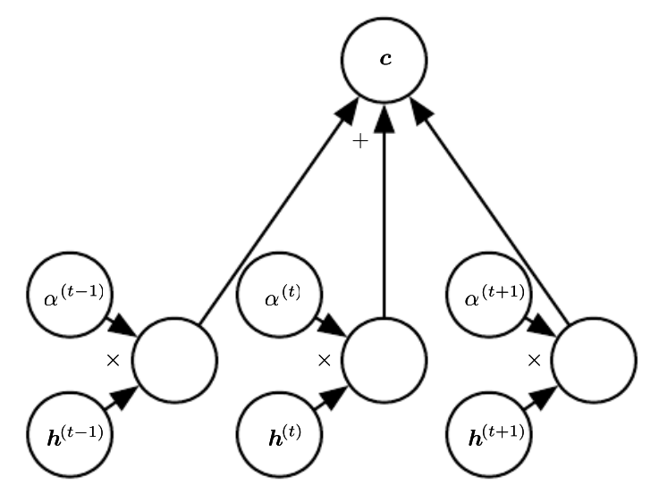
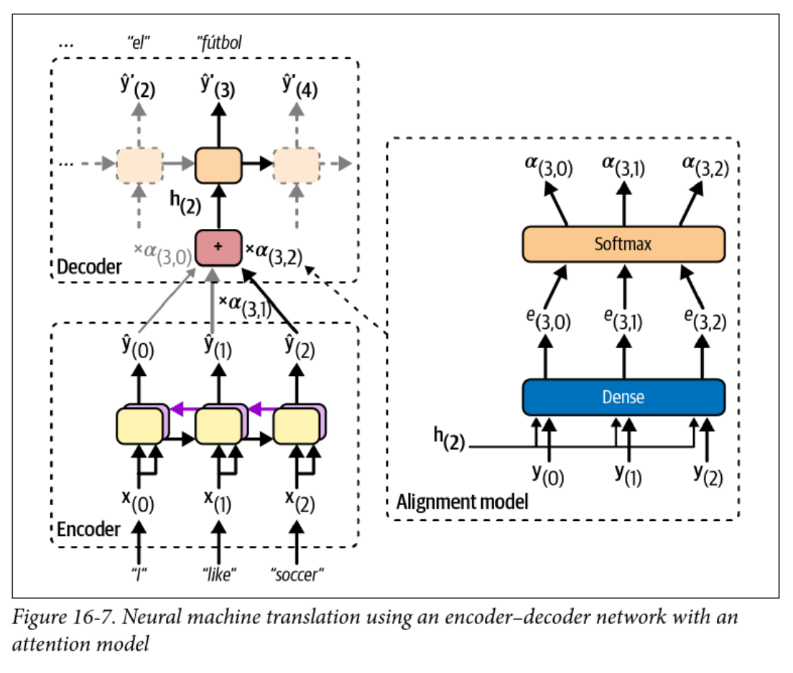
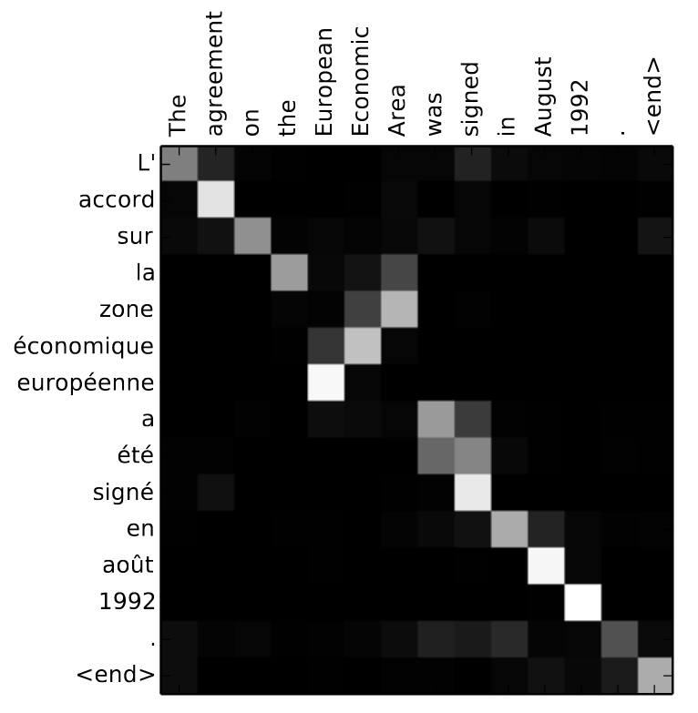

<!-- 
_class: invert lead
_paginate: skip
 -->

# Sequence to Sequence Models in NLP

COMP 4630 | Winter 2024
Charlotte Curtis

---

## Overview

- From sentiment analysis to machine translation
- A grab-bag of various topics, including:
    - Bidirectional RNNs
    - encoder-decoder models
    -  attention
- References and suggested reading:
    - [Scikit-learn book](https://librarysearch.mtroyal.ca/discovery/fulldisplay?context=L&vid=01MTROYAL_INST:02MTROYAL_INST&search_scope=MRULibrary&isFrbr=true&tab=MRULibraryResources&docid=alma9923265933604656): Chapter 16
    - [Deep Learning Book](https://www.deeplearningbook.org/): Chapter 12
    - [d2l.ai](https://d2l.ai/): Chapters 10-11

---

## :popcorn: Retraction Watch :popcorn:

<footer><a href="https://doi.org/10.1016/j.surfin.2024.104081">Paper 1</a>, <a href="https://doi.org/10.1016/j.radcr.2024.02.037">Paper 2</a></footer>

---

## Softmax Temperature

- The softmax is defined as:
  $$\text{softmax}(\mathbf{z})_i = \frac{\exp(z_i)}{\sum_{j=1}^n \exp(z_j)}$$
  where $\mathbf{z}$ is a vector of **logits**, or log probabilities
- This estimates the probability of class $i$ out of $n$ classes
- Adding a temperature parameter $T$:
  $$\text{softmax}(\mathbf{z}/T)_i = \frac{\exp(z_i/T)}{\sum_{j=1}^n \exp(z_j/T)}$$

---

## Back to RNNs
- RNNs are great for sequences as they can remember previous inputs, but they can't see the future
- This is exactly what we want for predicting stock prices, weather, etc
- :question: what if we want to predict the next word in a sentence?
- :question: what about translating a sentence from one language to another?
    > Time flies like an arrow; fruit flies like a banana.
- :question: Can you think of a way to get RNNs to see the future?

---

## Bidirectional RNNs

- Simple approach: just reverse the sequence

$$\begin{aligned}
\mathbf{h}_t &= \mathbf{W}_x^{(f)T} \mathbf{x}_t + \mathbf{W}_{h}^T \mathbf{h}_{t-1} + \mathbf{b}^{(f)}\\
\mathbf{g}_t &= \mathbf{W}_x^{(b)T} \mathbf{x}_t + \mathbf{W}_{g}^T \mathbf{g}_{t+1} + \mathbf{b}^{(b)}\\
\mathbf{\hat{y}}_t &= \mathbf{h}_t + \mathbf{g}_t
\end{aligned}$$

- :question: Drawbacks?

<footer>Figure 10.11 from the Deep Learning Book</footer>

---

## Pretrained Embeddings and transfer learning
- Embeddings like Word2Vec have been trained on large corpora
- Surely this provides a great starting point for our models!
    - :question: why might we want to use pretrained embeddings?
    - :question: what are some potential drawbacks?
- [ELMo](https://allennlp.org/elmo) was introduced in 2018 specifically to address the limitations of Word2Vec and GloVe (another popular embedding)

> "Our representations differ from traditional word type embeddings in that each token is assigned a representation that is a function of the entire input sentence. We use vectors derived from a bidirectional LSTM that is trained with a coupled language model objective on a large text corpus"

---

## Subword Tokenization
- Word embeddings are great, but still have limitations
- ELMo uses **character** tokenization to handle out-of-vocabulary words
- In between characters and words are **subwords**
  - `"This warm weather is enjoyable"`
  - `"This", "warm", "weath", "er", "is", "enjoy", "able"`
- [Byte Pair Encoding](https://en.wikipedia.org/wiki/Byte_pair_encoding) is the most common subword tokenization method, used by GPT and [BERT](https://arxiv.org/abs/1810.04805)
- :question: What are some advantages of subword tokenization?

---

## Machine Translation
| English | Spanish |
|---------|---------|
| My mother did nothing but weep | Mi madre no hizo nada sino llorar | 
| Croatia is in the southeastern part of Europe | Croacia está en el sudeste de Europa |
| I would prefer an honorable death | Preferiría una muerte honorable | 
| I have never eaten a mango before | Nunca he comido un mango |

- :question: What kind of challenges can you think of?
- :question: How might you approach this problem?

<!-- Challenges: different word order and length, special characters, grammar, idioms, etc -->
<!-- Approach: Intermediate representation -->

---

## Encoder-Decoder Models
- RNNs can convert an arbitrary length **sequence** into a fixed length **vector**
- RNNs can convert a fixed length **vector** into an arbitrary length **sequence**
- Why not use two RNNs to convert a **sequence** to a **sequence**?
- The encoded vector is usually called the **context**
- The output head is a softmax layer with one node for each word in the target vocabulary
- :question: What problems can you think of with this approach?
- :question: How might you address these problems?

<!-- As vocab grows, softmax is very slow. Sampled softmax is one solution -->

---

---

## Teacher Forcing
- This model uses **teacher forcing** to train the decoder
- It feels like cheating, but this involves feeding the **correct output** to the decoder at each time step
- This speeds up training and can improve performance
- Avoids the whole backpropagation through time thing and makes training of RNNs parallelizable
- :question: How would this work with LSTM/GRU cells?
- :question: What are the implications at inference time?

---

## Finally: Attention!

- Basically a weighted average of the encoder states, called the **context**
- Weights $\alpha$ usually come from a softmax layer
- :question: what does the use of softmax tell us about the weights?

---

## Encoder-Decoder with Attention

- The **alignment model** is used to calculate attention weights
- The context vector changes at each time step!
- :question: Why is this beneficial?

---

## Attention Example

- Attention weights can be visualized as a heatmap
- :question: What can you infer from this heatmap?

---

## Things I skipped
- **Stateful RNNs**: Maintaining state between batches
- **Masked language models**: predicting a word given the surrounding words
- **Beam search**: a way to find the most likely sequence of words
- Many other things that I don't even know about

---

<!-- 
_class: invert lead
_paginate: skip
 -->

## Next up: Multi-head attention and Transformers