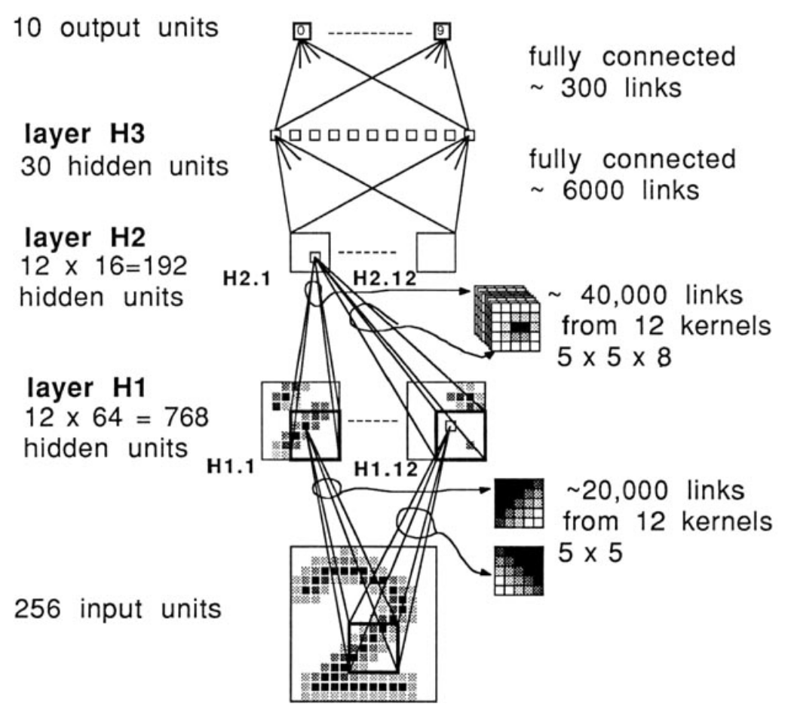
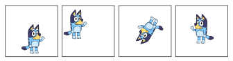
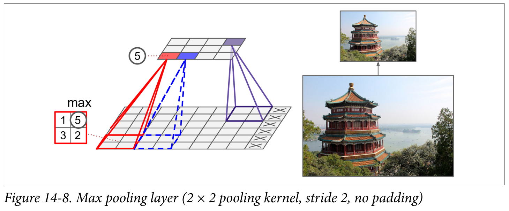
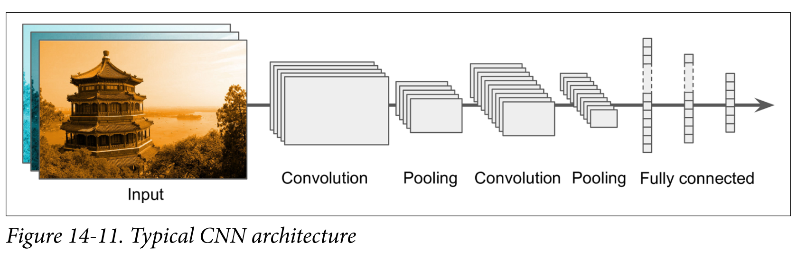

<!-- 
_class: invert lead
_paginate: skip
 -->

# Intro to Convolution

COMP 4630 | Winter 2024
Charlotte Curtis

---

## Overview
- **Convolutional neural networks** (CNNs) are a type of neural network that is particularly well-suited to image data
- Before we can understand CNNs, we need to understand **convolution**
- References and suggested reading:
    - [Scikit-learn book](https://librarysearch.mtroyal.ca/discovery/fulldisplay?context=L&vid=01MTROYAL_INST:02MTROYAL_INST&search_scope=MRULibrary&isFrbr=true&tab=MRULibraryResources&docid=alma9923265933604656): Chapter 14
    - [Deep Learning Book](https://www.deeplearningbook.org/): Chapter 9
    - [3blue1brown video](https://www.youtube.com/watch?v=KuXjwB4LzSA): What is convolution?
---

## Convolution
- **Convolution** is defined as:
    $$(f * g)(t) = \int_{-\infty}^{\infty} f(\tau)g(t-\tau)d\tau$$

- Or in the discrete case:
    $$(f * g)[n] = \sum_{m=-\infty}^{\infty} f[m]g[n-m]$$

- Can be though of as "flipping" one function and sliding it over the other, multiplying and summing at each point

---

## Example
- Suppose we have two 1D arrays:
    $$\begin{aligned}f =& [1, 2, 3, 4]\\
    g =& [1, 1, 1]\end{aligned}$$
- For $h = f * g$:
  $$\begin{aligned}h[0] =& f[0]g[0] + f[1]g[-1] + f[2]g[-2] = 1 \cdot 1 = 1\\
    h[1] =& f[0]g[1] + f[1]g[0] = 1 \cdot 1 + 2 \cdot 1 = 3\\
    h[2] =& f[0]g[2] + f[1]g[1] + f[2]g[0] = 1 \cdot 1 + 2 \cdot 1 + 3 \cdot 1 = 6\\
    ... etc
  \end{aligned}$$

---

## Convolution in 2D
- Extending to 2D basically adds another summation/integration:
  $$\begin{aligned}(f * g)[n, m] =& \sum_{i=-\infty}^{\infty}\sum_{j=-\infty}^{\infty} f[i, j]g[n-i, m-j]\\
  (f * g)(x, y) =& \int_{-\infty}^{\infty}\int_{-\infty}^{\infty} f(u, v)g(x-u, y-v)dudv\end{aligned}$$
- This can also be extended to higher dimensions
- Caution: a **colour image** is a 3D array, not a 2D array
- For typical image processing applications, the **colour channels** are convolved **independently** such that the output is still a 3D array

---

## Convolution kernels

- Typically there is a small **kernel** that is convolved with the input
- This is just the smaller of the two functions in the convolution
- :question: What happens at the edges of the input?

<footer>By Michael Plotke - Own work, CC BY-SA 3.0, <a href="https://commons.wikimedia.org/w/index.php?curid=24288958">From Wikipedia</a></footer>

---

## Some common kernels

- Averaging:
$$\frac{1}{9}\begin{bmatrix}1 & 1 & 1\\1 & 1 & 1\\1 & 1 & 1\end{bmatrix}$$
- Differentiation: 
 $$\begin{bmatrix}-1 & 0 & 1\\-1 & 0 & 1\\-1 & 0 & 1\end{bmatrix}$$

- Sizes are commonly chosen to be 3x3, 5x5, 7x7, etc.
- :question: Why divide by 9?
- :question: Why odd sizes?
- :question: What effect do you think these kernels will have on an image?

---

## Convolutional neural networks

- 1958: Hubel and Wiesel experiment on cats and reveal the structure of the visual cortex
- Determine that specific neurons react to specific features and **receptive fields**
- Modelled in the "neocognitron" by Kunihiko Fukushima in 1980
- LeCun's work in the 1990s led to modern CNNs

---

## Why CNNs?
- A fully connected network has a 1:1 mapping of weights to inputs
- Fine for MNIST (28x28) pixels, but quickly grows out of control
- :question: If you train a (fully connected) network on 100x100 images, how would you infer on 200x200 images?
- :question: What if an object is shifted, rotated, or flipped within the image?
   

<footer>Bluey image used without permission from <a href="https://www.bluey.tv/">bluey.tv</a>

---

## Convolutional layers
- A **convolution layer** is a set of kernels whose weights are learned
- Instead of the straight up weighted sum of inputs, the input image is convolved with the learned kernel(s)
- The output is often referred to as a **feature map**
- The dimensionality of the feature map is determined by the:
    - Size of the input image
    - Number of kernels
    - Padding (usually "same" or "valid")
    - "Stride", or shift of the kernel at each step

---

## Dimensionality examples

| Input | Kernel | Stride | Padding | Output |
|-------|--------|--------|---------| ------ | 
| $100 \times 100 \times 3$ | $5 \times 5 \times 32$ | 1 | same | $100 \times 100 \times 32$ |
| $100 \times 100 \times 1$ | $5 \times 5 \times 32$ | 2 | same | $50 \times 50 \times 32$ |
| $100 \times 100 \times 3$ | $5 \times 5 \times 32$ | 1 | valid | ??? |

- The number of channels has no impact on the depth of the output: the number of **kernels** determines the depth of the output
- The colour channels are convolved independently, then summed

---

## Pooling layers
**Pooling layers** are used to reduce the dimensionality of the feature maps (aka **downsampling**) by taking the maximum or average of a region

  

- :question: Why would we want to downsample?

<footer>Figure from <a href="https://librarysearch.mtroyal.ca/discovery/fulldisplay?context=L&vid=01MTROYAL_INST:02MTROYAL_INST&search_scope=MRULibrary&isFrbr=true&tab=MRULibraryResources&docid=alma9923265933604656">Scikit-learn book</a></footer>

---

## Putting it all together

<footer>Figure from <a href="https://librarysearch.mtroyal.ca/discovery/fulldisplay?context=L&vid=01MTROYAL_INST:02MTROYAL_INST&search_scope=MRULibrary&isFrbr=true&tab=MRULibraryResources&docid=alma9923265933604656">Scikit-learn book</a></footer>

---

## Regularizing with Dropout
- Our Fashion MNIST model does a pretty good job, but it looks like it starts overfitting pretty quickly
- In addition to the loss-based regularization techniques, we can randomly select a subset of neurons to "drop" during training
- At each training pass, a given neuron has a probability $p$ of being dropped
- This is implemented with a **dropout layer** in Keras, where dropped neurons are multiplied by 0 and the remaining neurons are multiplied by $\frac{1}{1-p}$
- Key point: dropout is only used during training, not during inference

---

<!-- 
_class: invert lead
_paginate: skip
 -->

 ## Next up: Assignment 2 and model training