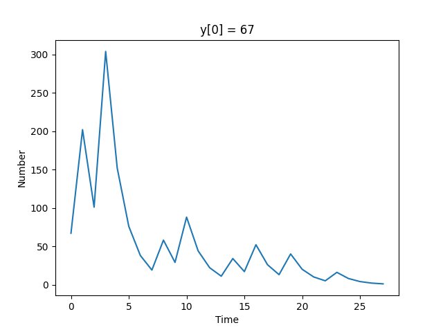
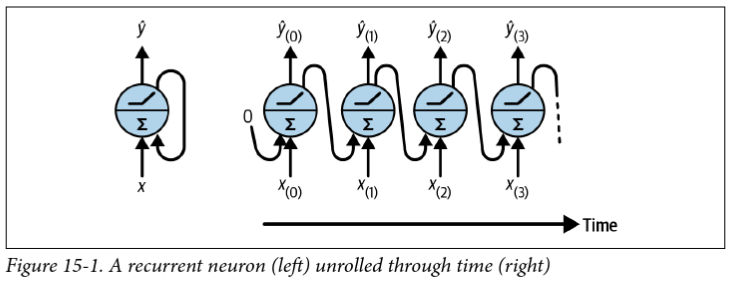
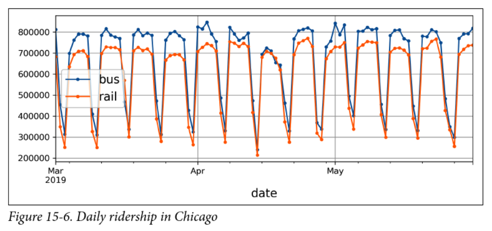
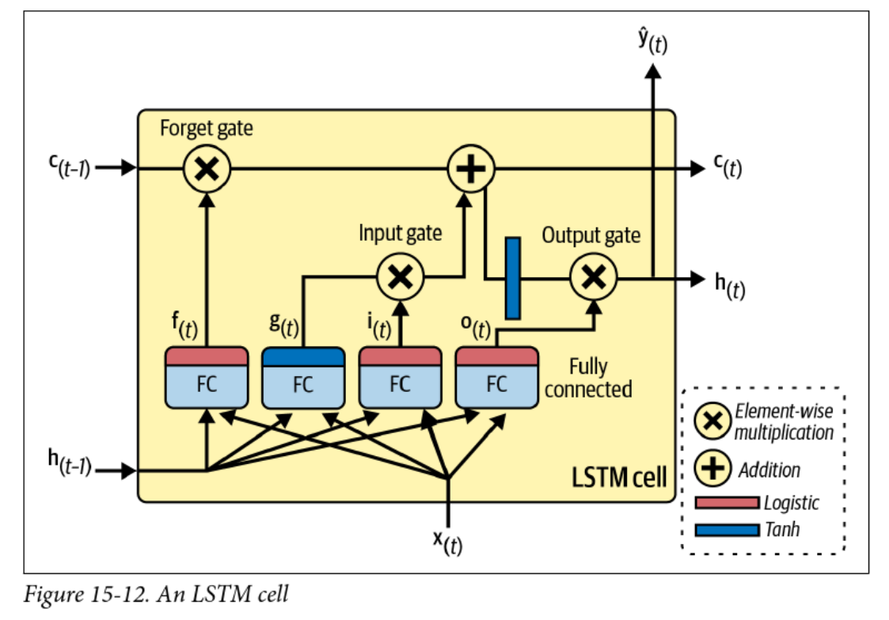
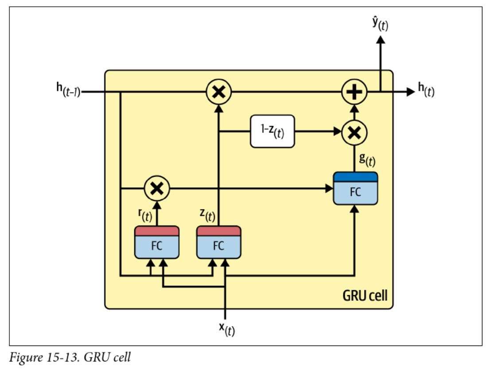

<!-- 
_class: invert lead
_paginate: skip
 -->

# Recurrent Neural Networks

COMP 4630 | Winter 2024
Charlotte Curtis

---

## Overview

- Dealing with sequence data
- Feedforward vs recurrent networks
- References and suggested reading:
    - [Scikit-learn book](https://librarysearch.mtroyal.ca/discovery/fulldisplay?context=L&vid=01MTROYAL_INST:02MTROYAL_INST&search_scope=MRULibrary&isFrbr=true&tab=MRULibraryResources&docid=alma9923265933604656): Chapter 15
    - [Deep Learning Book](https://www.deeplearningbook.org/): Chapter 10

---

## Sequence data
- So far we've been talking about images, tabular data, and other "static" data
- :question: What are some examples of sequence data?

$$y[n] = \begin{cases} \frac{y[n - 1]}{2} & \text{if } n \text{ is even} \\ 3y[n - 1] + 1 & \text{if } n \text{ is odd} \end{cases}$$

---

## Feedforward vs recurrent networks
- Feedforward: data flows in one direction (then backpropagated)
- Recurrent: data can flow in loops

<footer>Figure from Scikit-learn textbook</footer>

---

## Recurrent layers
- The simplest recurrent layer has a single feedback connection
    $$\mathbf{\hat{h}}_t = f(\mathbf{W}_x^T \mathbf{x}_t + \mathbf{W}_{\hat{y}}^T \mathbf{\hat{h}}_{t-1} + \mathbf{b})$$
    where $f$ is the activation function and $\mathbf{W}_x$ and $\mathbf{W}_{\hat{y}}$ are weight matrices
- "Backpropagation through time" (BPTT) is exactly the same as regular backpropagation through the **unrolled** network
- :question: What kind of issues might arise during training?
- :question: What are some limitations of this approach?
- :question: How can we deal with $\mathbf{h}_{t-1}$ for $t = 0$?

---

## Non-RNN Approaches

Non-RNN approaches include naive methods and **autoregressive** models

- :question: How might you go about predicting the next value?
- :question: What are some limitations of naive approaches?

---

## Trends, Seasonality, and Assumptions

- :question: Are there any obvious trends in the data?
- :question: What about non-obvious trends?
- :question: How might this dataset be treated differently from the previous one?

<footer>Figure from Scikit-learn textbook</footer>

---

## Preparing data for RNNs
- The data format depends on the task, e.g. do you want to predict:
    - The next value in a sequence (e.g. predictive text)
    - The next $n$ values in a sequence (e.g. stock prices)
    - The next sequence in a set of sequences (e.g. language translation)
- Let's start with predicting the next value in a sequence

<footer>Image from <a href="https://www.tensorflow.org/tutorials/structured_data/time_series">TensorFlow Time Series Tutorial</a></footer>

---

## Side note: Activation Functions and Normalization
- The default activation function in tensorflow is `tanh`
- In the simple example, I had to change to `relu` because my data was not normalized and `tanh` was saturating
- :question: What is different about RNNs that might influence the choice of activation function?
- :question: How might we normalize sequence data?

---

## Beyond the "next value"
- RNNs can also be used to predict the next $n$ values in a sequence
- Chapter 15 and associated [notebook](https://github.com/ageron/handson-ml3/blob/main/15_processing_sequences_using_rnns_and_cnns.ipynb) has great examples, but the data processing gets funky:
    | $n$ | Input       | Target                              |
    | --- | ----------- | ----------------------------------- |
    | 1   | `[0, 1, 2]` | `[1, 2, 3]`                         |
    | 2   | `[0, 1, 2]` | `[[1, 2], [2, 3], [3, 4]]`          |
    | 3   | `[0, 1, 2]` | `[[1, 2, 3], [2, 3, 4], [3, 4, 5]]` |

---

## Problems with long sequences
- Gradient vanishing/exploding
    - Choose activation functions and initialization carefully
    - Consider "Layer normalization" (across features)
- "Forgetting" early data
    - Skip connections through time
    - "Leaky" RNNs
    - Long short-term memory (LSTM)
- Computational efficiency and memory constraints
    - Gated recurrent units (GRUs)

---

## Skip connections and leaky RNNs
- Simple way of preserving earlier data:
- Vanilla RNN: $h^{(t)}$ depends on $h^{(t-1)}$
- Skip connection: $h^{(t)}$ depends on $h^{(t-1)}$, $h^{(t-2)}$, $h^{(t-n)}$, etc.
- Leaky RNN has a smooth "self-connection" to dampen the exponential:
    $$h^{(t)} = \alpha h^{(t-1)} + (1 - \alpha) h^{(t)}$$
- Not common approaches anymore, as LSTM, GRU, and especially attention mechanisms are more popular

---

## Long Short-Term Memory (LSTM)

<footer>Figure from Scikit-learn textbook</footer>

---

## Gated Recurrent Units (GRUs)

<footer>Figure from Scikit-learn textbook</footer>

---

<!-- 
_class: invert lead
_paginate: skip
 -->

 ## Next up: Natural Language Processing

 ---

## Preview: Natural Language Processing

- Natural Language Processing (NLP) is a field of study that focuses on the interaction between computers and human language.
- RNNs are widely used in NLP tasks such as language modeling, machine translation, sentiment analysis, and text generation.
- Language modeling involves predicting the next word in a sequence of words, which can be done using RNNs.
- Machine translation uses RNNs to translate text from one language to another.
- Sentiment analysis aims to determine the sentiment or emotion expressed in a piece of text, and RNNs can be used for this task.
- Text generation involves generating new text based on a given input, and RNNs are commonly used for this purpose.

<footer>This slide written by GitHub Copilot</footer>